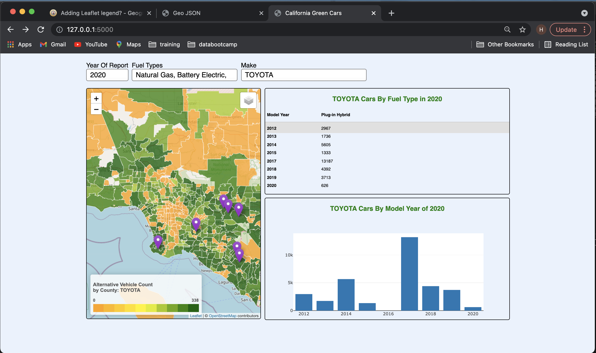

# GREEN VEHICLES

### Teammates:

Henry

E

Kacee Kira

### Purpose:

With Biden’s administration voicing their commitment to move the country towards green cars, we seek to analyze the current usage of demographics of cars in the state of California by focusing on vehicle fuel type by zip codes, as well as by auto maker. This will provide a sense of where California is at in terms of our path towards a greener state and room to create a roadmap in achieving our goal. On the other hand, auto makers can also use this service to identify where they are selling the most alternative vehicles and where they are selling less or none. By identifying this, auto makers can more efficiently and strategically deploy their advertising and incentive resources to achieve better results.

### Dashboard Operation:
Begin by running the app.py Flask app. 
Select the fuel types and then the auto maker from both the 'fuel types' and 'make' drop down menus in order to see all three panels populated.

### Research Questions:

1. California green vehicle initiative: How well it has taken root in metropolitan and rural counties
2. Market share of green cars by make and model
3. Market share of green cars by zip code
4. Targeted areas for charging stations
5. Targeted areas(zip code) for green energy incentives

### Data Source:

Vehicle Fuel Type Count by Zip Code:
https://data.ca.gov/dataset/vehicle-fuel-type-count-by-zip-code
The report provides vehicle counts broken down by ZIP code, model year, fuel type, make and duty (light/heavy) of registered vehicles as of 10/1/2018.

### Tools:

- HTML/CSS
- Leaflet
- GeoJSON
- D3
- Flask
- Postgres

### Fuel Type Definitions:

The following fuel types were used when counting vehicles registered per zip code in California. We focused our efforts on analyzing the alternative types.

> ALTERNATIVE TYPES:
> 'Battery Electric'
> 'Plug-in Hybrid'
> 'Flex-Fuel'
> 'Hydgogen Fuel Cell'
> 'Natural Gas'

> CONVENTIONAL TYPES:
> 'Hybrid Gasoline'
> 'Other'
> 'Gasoline'
> 'Diesel and Diesel Hybrid'

### Conclusions / Final Analysis:

Auto companies that are successfully selling their alternate fuel automobiles in many zip codes should have a vested interest in ensuring there are plenty of charging stations in those same areas.
The same auto companies should look at zip codes where sales of their alternate fuel automobiles are low or zero. Look into ways for them to incentivize residents of those zip codes to purchase their models.

### Challenges:

The team was working with different versions of JavaScript libraries and separate copies of the HTML file. We had to resolve compatibility issues when merging the code.
Choropleth map development became complex with integrating database data for every auto maker into the geoJSON dataset to avoid costly processing time per auto maker.
Database connectivity to AWS was sometimes error prone if the Flask app was running while other team members tried to access the same tables via PgAdmin; killing the app sometimes leared the connectivity issues.

### Next steps (with time, what would we do?)

We had data from 2018. Did not load that information in favor of getting dataset from 2020 to work. With 2018 data for comparison, we might see what upward or downward trends are visible over time in all California zip codes per auto manufacturer.
We could have expanded our queries and interactions with the database to allow for combination selection of fuel types to do more comparisons. With the gasoline fuel type also in the data of registered vehicles, we might be able to see how each car company’s gasoline footprint is changing.

---

### Thank you!
